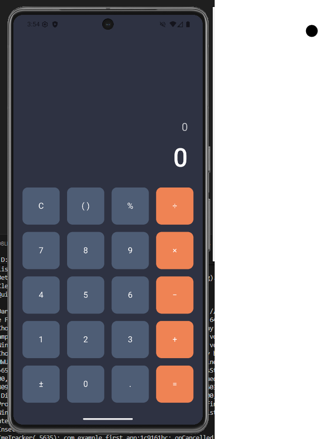

# Flutter Calculator App (Lab 2)

## i. Project Description (Mô tả dự án)

Đây là ứng dụng máy tính di động được xây dựng bằng Flutter, hoàn thành theo yêu cầu của **Bài Lab 2**. Ứng dụng này mô phỏng một máy tính cơ bản với đầy đủ các chức năng toán học, giao diện được thiết kế tuân thủ các thông số kỹ thuật (Design Specifications) được cung cấp.

**Thông số kỹ thuật (Tuân thủ theo Figma):**
* **Màu sắc:**
    * Nền chính (Primary): `#2D3142`
    * Nút phụ (Secondary): `#4F5D75`
    * Nút toán tử (Accent): `#EF8354`
* **Font:** `Roboto` (được tải bằng thư viện `google_fonts`).
* **Layout:** Padding màn hình `20px`, khoảng cách nút `16px`, và bo góc `12px`.

## ii. Screenshots (Ảnh chụp màn hình)

Giao diện ứng dụng khi chạy thực tế:



## iii. How to Run the Project (Hướng dẫn chạy dự án)

### 🚀 Live Demo (Phiên bản Web)

Trải nghiệm ứng dụng trực tiếp trên Vercel tại đường dẫn sau:

**[https://calculator-app-sigma-sage.vercel.app](https://calculator-app-sigma-sage.vercel.app)**

*Lưu ý: Vì đây là giao diện thiết kế cho Mobile, vui lòng nhấn **F12** -> chọn **Chế độ xem di động** (Ctrl+Shift+M) trên trình duyệt để có trải nghiệm tốt nhất.*

### Cài đặt (Local Setup)

Để chạy dự án này trên máy cá nhân, vui lòng thực hiện theo các bước sau:

1.  **Cài đặt Flutter:** Đảm bảo bạn đã cài đặt [Flutter SDK](https://flutter.dev/docs/get-started/install).
2.  **Clone dự án:** Tải mã nguồn về máy.
    ```bash
    git clone https://github.com/kiet7732/calculator_app.git
    ```
3.  **Di chuyển vào thư mục:**
    ```bash
    cd calculator_app
    ```
4.  **Cài đặt thư viện:** Mở terminal tại thư mục gốc của dự án và chạy lệnh:
    ```bash
    flutter pub get
    ```
5.  **Chạy ứng dụng:** Kết nối thiết bị hoặc mở máy ảo, sau đó chạy lệnh:
    ```bash
    flutter run
    ```

## iv. Additional Features Implemented (Tính năng bổ sung)

Ngoài các yêu cầu cơ bản của bài Lab, dự án đã được bổ sung các tính năng và kỹ thuật sau:

* **Bộ xử lý toán học (Math Expression Parser):**
    * Sử dụng gói `math_expressions` để phân tích và tính toán chuỗi nhập liệu, thay vì tự viết logic thủ công dễ gây lỗi. Giúp xử lý chính xác các biểu thức như `5 + 3 × 2 = 11`.

* **Logic tính toán thông minh (Smart State Handling):**
    * Đã sửa lỗi logic giúp trải nghiệm giống máy tính thật:
        * Sau khi bấm dấu "="" để ra kết quả, nếu người dùng bấm tiếp một **toán tử** (ví dụ `+`), ứng dụng sẽ tự động lấy kết quả cũ để tính tiếp (ví dụ: `...= 10`, nhấn `+` -> `10+`).
        * Nếu người dùng bấm một **số** (ví dụ `2`), ứng dụng sẽ tự động xóa kết quả cũ và bắt đầu phép tính mới.

* **Xử lý lỗi (Error Handling):**
    * Bắt lỗi chia cho 0 hoặc biểu thức không hợp lệ và hiển thị thông báo "Lỗi" trên màn hình.
    * Logic ngăn chặn nhập nhiều dấu chấm (`.`) trong cùng một số.
    * Tự động xử lý việc nhập đè toán tử (ví dụ: nhập `+` rồi nhập `-` sẽ nhận `-`).

* **Tích hợp Font chữ:**
    * Sử dụng gói `google_fonts` để áp dụng font chữ **Roboto** một cách nhất quán.

* **Cấu trúc code sạch (Clean Code):**
    * Tách Widget `CalculatorButton` ra file riêng để code gọn gàng và dễ tái sử dụng.
    * Sử dụng các biến hằng số (`const Color`) trong `main.dart` để quản lý theme màu sắc tập trung.

---
**Thông tin sinh viên:**
* **Họ tên:** Nguyễn Tuấn Kiệt
* **MSSV:** 2224801030058
